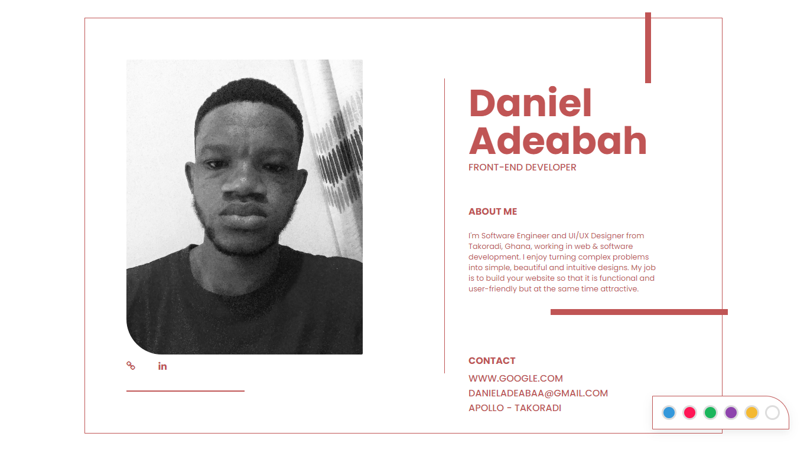
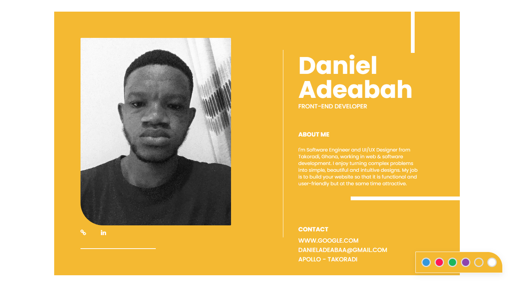
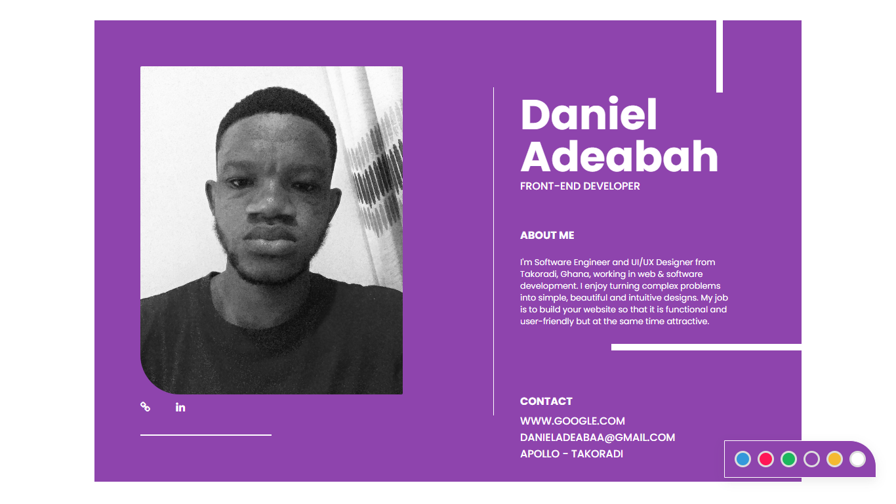
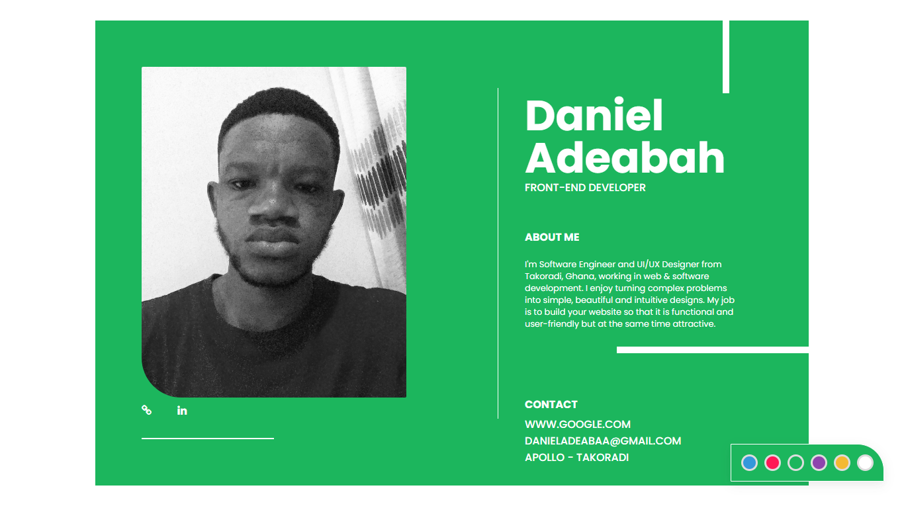
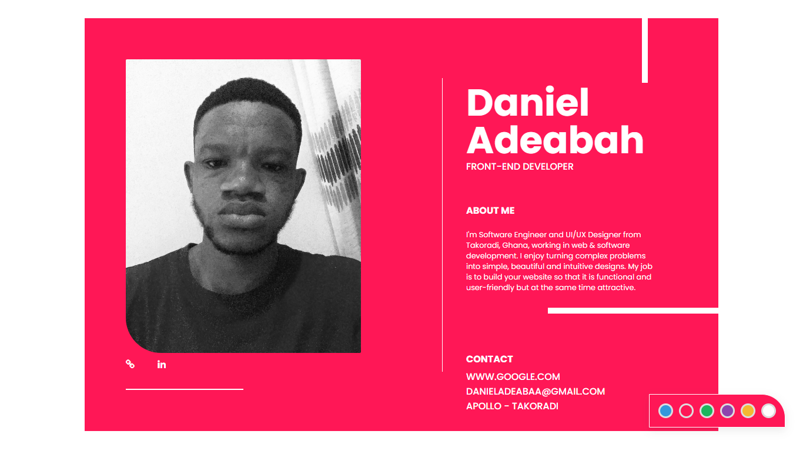
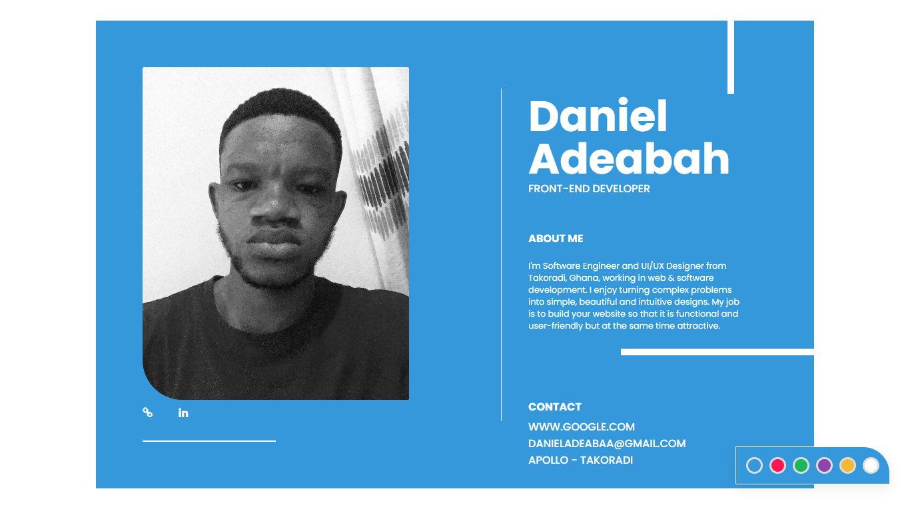

# Profile Card
Building a profile card with themes and responsive interactions

## Screenshot

#### Languages 
<code>- HTML5 
- CSS 
- JAVASCRIPT</code>

use the command to upload to your local machine for free

<code>git clone https://github.com/danieladeabah/about-me.git</code>

Connect me on my <a href="https://www.linkedin.com/in/danieladeabaa" title="Daniel Adeabah" target="_blank">LinkendIn</a>

Thank you

